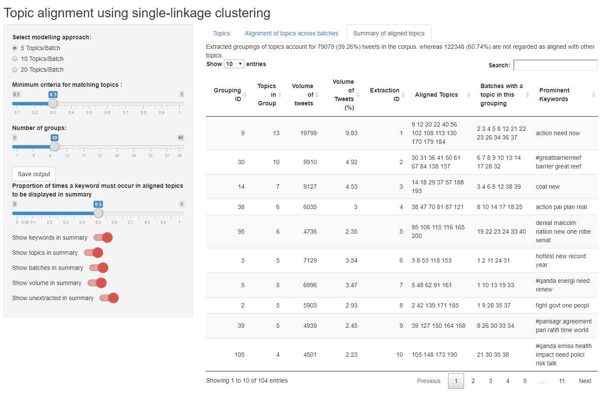

# TopicAlignment

## Description

This repository houses data and scripts from Andreotta, Nugroho, Hurlstone, Boschetti, Farrell, Walker, and Paris study on Australian climate change tweets (accepted by Behavior Research Methods, preprint DOI: [10.31234/osf.io/bynz4](https://psyarxiv.com/bynz4)). This research was preregistered on the Open Science Framework under the project "Examining Australian Climate Change Discourse Through a Social Media Lens 1.1", <https://osf.io/mb8kh/>. For those interested in the topics derived by Andreotta et al., please refer to [**/data**](/data/rawdata.csv). For those interested in the alignment of topics, please refer to [**/out**](/out). The scripts contain an algorithm to align topics, based on the work of Chuang et al. (2015). Identifies similar topics that occur across separate executions of the same topic modeling algorithm (i.e., topics that reproduce). See Chuang et al. (2015) for more detail.

The scripts are coded in R (version 3.5.0; R Core Team, 2018) using RStudio (version 1.1.453; RStudio Team, 2016) for Windows 10. Several packages were used to complete these scripts: tidyverse (version 1.2.1; Wickham, 2017), shiny (version 1.1.0; Chang, Cheng, Allaire, Xie, & McPherson, 2018), shinyWidgets (version 0.4.3; Perrier, Meyer, & Granjon, 2018), DT (version 0.4; Xie, 2018), and xml2 (version 1.2.0; Wickham, Hester, & Ooms, 2018).

The script deploys a Shiny App to display the aligned topics. The app can be used to explore the impact of various parameters of this process. See below for more detail.

The topic alignment algorithm of Chuang at al. (2015) has been augmented to include more stringent criteria for grouping. Before two groups are merged, the similarity between each pair of topics is calculated. If the mean similarity is below 0.3, the groups cannot be merged. This criteria can be altered or removed from the script in the detect_mostsimilar function found in **/script/topicalignment.R**

### References

Chang, W., Cheng, J., Allaire, J.J., & Xie, Y. & McPherson, J. (2018). shiny: Web Application Framework for R. R package version 1.1.0. <https://CRAN.R-project.org/package=shiny>.

Chuang, J., Roberts, M. E., Stewart, B. M., Weiss, R., Tingley, D., Grimmer, J., & Heer, J. (2015). TopicCheck: Interactive alignment for assessing topic model stability. *In Proceedings of the Conference of the North American Chapter of the Association for Computational Linguistics - Human Language Technologies* (pp. 175–184). Denver, Colorado: Association for Computational Linguistics. <http://dx.doi.org/10.3115/v1/N15-1018>.

Perrier, V. Meyer, F. & Granjon, D. (2018). shinyWidgets: Custom Inputs Widgets for Shiny. R package version 0.4.3. <https://CRAN.R-project.org/package=shinyWidgets>

R Core Team (2018). R: A language and environment for statistical computing. R Foundation for Statistical Computing, Vienna, Austria. <https://www.R-project.org/>.

RStudio Team (2016). RStudio: Integrated Development for R. <i>RStudio, Inc.</i>, Boston, MA. <http://www.rstudio.com/>.

Wickham, H. (2017). tidyverse: Easily Install and Load the 'Tidyverse'. R package version 1.2.1. <https://CRAN.R-project.org/package=tidyverse>.

Wickham, H., Hester, J. & Ooms, J. (2018). xml2: Parse XML. R package version 1.2.0. https://CRAN.R-project.org/package=xml2

Xie, Y. (2018). DT: A Wrapper of the JavaScript Library 'DataTables'. R package version 0.4. <https://CRAN.R-project.org/package=DT>.

## Repository structure

**/data** contains the [data set used by Andreotta et al.](/data/rawdata.csv), who modeled the topics of 41 independent batches of tweets concerning climate change, indicated in the *batch* column of the data set. Three topic solutions were generated, each differing according to the topics generated per batch (i.e., *topicsperbatch* = 5, 10, or 20). For each *topicsperbatch*, a unique ID was allocated to each *topic*. For each *topic*, the ten terms with the strongest relationship to the topic are extracted (though only terms with a value higher than the mean value for all terms are extracted). These *keywords* are delineated with a '|' in the data file. Lastly, the <i>vol</i>ume of tweets in each topic is reported.

**/script** contains two scripts. First, *topicalignment.R* is used to detect the similarities between topics (though, these can be manually entered as .csv in **/out**), group topics according to levels of similarity (these results are stored in **/out**), and deploy an Shiny App to explore/refine results. The second script is *extractIDs.R*, demonstrating how Andreotta et al. extracted tweets from each group of topics. The data file of tweet IDs is not provided due to ethical obligations.

**/out** contains .csv of _similarity matrices_ (for each *topicsperbatch*) and .csv output for topic alignment algorithm (for each *topicsperbatch*). The _topic alignment output_ is structured as */data/rawdata.csv*, with the addition of extra columns equivalent to various thresholds (G3 = similarity threshold of 0.3 as per Andreotta et al., see script for more information). Lastly, **/out** contains the _output files from the Shiny App_ (e.g., *output_k5*). The Shiny App is used to extract groups of topics satisfying certain criteria (see below), and classify the remaining groups as 'unextracted' (i.e., extract = 0). The file is structured as */data/rawdata.csv* with the addition of an *extract* variable denoting each topic's group membership

**/img** contains a set of images for README files.

## Description of App

Executing **/script/topicalignment.R** will produce a Shiny App displaying the results from Andreotta et al. The app allows users to interact with the data set by altering the parameters for grouping. As seen below, the user may alter three parameters: (1) the topic model examined (5, 10, or 20 topics per batch), (2) the minimum criteria for matching topics, below which topics are deemed too dissimilar to be grouped, and (3) the number of groups the user would like to extract from the grouping output (the groups containing the most topics will be extracted, the volume of tweets in groups is used to resolve ties). The remaining options allow users to save their output, as well as alter the display of the app (relevant for the third tab, "Summary of aligned topics")

The first of three tabs ("Topics") in the app allows users to browse the data set. The second tab ("Alignment of topics across batches") allows users to view the alignment of topics corresponding to their parameter selection. On the horizontal axis are the batches. Each square represents a topic in the data set. Squares in pink have been aligned, whereas squares in grey did not satisfy the criteria for alignment ('unextracted'). The groupings are ordered according to the number of topics aligned, and are shown on the vertical axis (from 1 to the number of groups extracted, after which unextracted topics are shown in grey). If the number of groups extracted is changed, the figure will adapt accordingly:

Lastly, the final tab "Summary of aligned topics" presents a tabulated summary of the aligned topics. Each row of this table is a group of topics classified as similar by the algorithm. *Grouping ID* contains a unique ID for each group of topics. *Topics in Group* is the number of topics in each group. *Volume of tweets* is the total number of tweets belonging to a group of topics. *Volume of tweets (%)* expresses volume as a percentage of the total corpus. *Prominent Keywords* contains keywords shared between the topics grouped. Users can alter the definition of 'prominent' through the slider "Proportion of times a keyword must occur in aligned topics to be displayed in summary". If set at 0, all keywords belonging to all topics in each group will be shown. If set to 1, only keywords shared between all topics in a group will be displayed (see below).

The proportion of the corpus covered by extracted groupings is indicated above the table in a sentence form.

A variety of display options exist for users wishing to see more information (see below). Users can hide the keyword and volume columns of the table by switching off the corresponding buttons. Users wishing to see the specific topics aligned can activate the button: "Show topics in summary". Users can view the batches which correspond to a given grouping by activating "Show batches in summary". Lastly, users can view the results of all groupings (including ones classified as unextracted) by activating the "Show unextracted in summary" button. This option adds an "Extraction ID" to the table, where alignments are given the ID corresponding to the figure on the second tab. Unextracted alignments are allocated an ID of 0.

